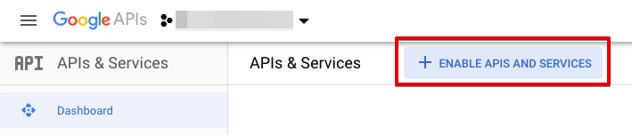
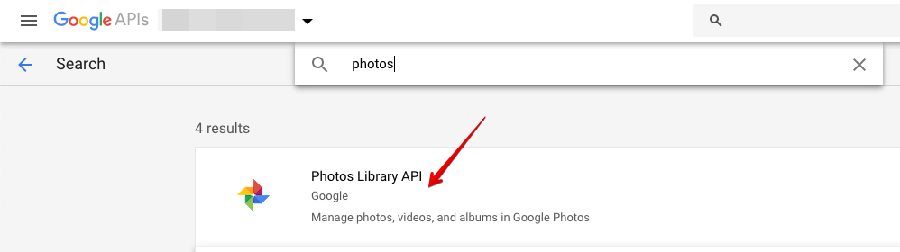
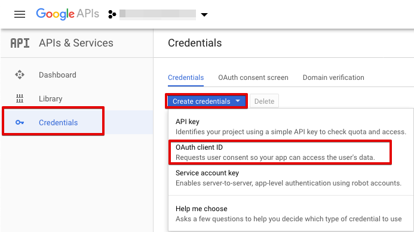
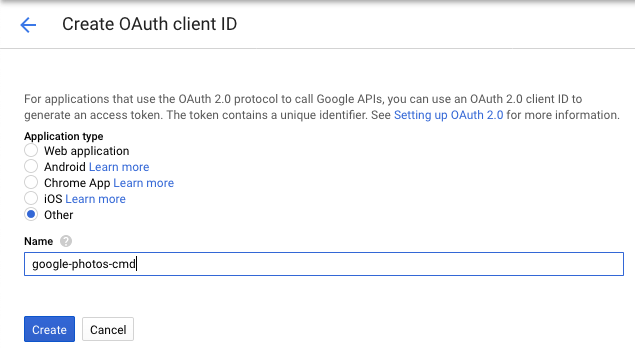
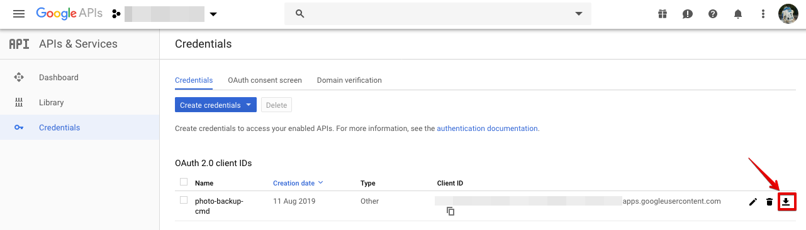

Google Photos Backup
======================

Simple Pyhton 3 tool to download / backup the photos in your Google Photos library

Since July, 2019, Google stopped syncing the Google Photos library to Google Drive. This makes it much harder to simply
file-backup your photos from Google Photos.

Luckily, Google Photos comes with a REST API, which allows querying and downloading the Photos library.
This script is a very simple approach to fetch your Google Photos automatically.

**Note**: This is a very first draft of the script. It is NOT tested thoroughly, and it is NOT implemented in a secure and stable way! Be aware!

Requirements
---------------

* Python >= 3.4.1
* A Google Photos account and access to the Google Developer Console (https://console.developers.google.com/)

Setup
-------

### Step 1: Enable the Photos API

You need to enable the Photos API in order to use it.

1. Log in to https://console.developers.google.com/
2. In the Dashboard, click on "Enable APIs and Services":<br/>
   
3. Search for "Photos", and select the Photos entry:<br />
   
4. Click the "Enable API" button

Return to the Developer Console Dashboard.

### Step 2: Create a Google OAuth 2.0 Client ID

The Google Photos API only works with OAuth 2.0. You need to create an OAuth 2.0 Client ID and download your secret credentials
in order to use them with the pyhton tool.

1. In the Developer Console, click "Credentials" in the left menu, then select "Create Credentials" &gt; "OAuth Client ID":<br/>
   
2. Select "Other" in the Create OAuth client ID menu, and provide a name. This name is not important for the application, just for you to
   recognize it later.<br/>
   
3. Click "Create".
4. Back in the Dashboard's "Credentials" menu, click the download button on the newly created client it. The JSON file you get contains
   the secret client tokens. KEEP IT IN A SAFE PLACE, it contains the keys that allow access the Google Photos library! <br />
   


### Step 3: Setup the tool

After downloading / cloning this repo, make sure to install the needed requirements:

```bash
$ cd google-photo-backup/

# Optional, but recommended: create a virtual env:
$ python3 -m venv env && source env/bin/activate

# Install the saved requirements:
(env) $ pip install -r requirements.txt
```

Usage
--------

Once the setup is complete, you start the tool with the following command:

```bash
(env) $ python google-photo-backup.py -c /path/to/your/secret/client-id.json /path/to/photo/backup/folder
```

The `client-id.json` file in the above's example is the path to the file you downloaded from the Developer Console in the Setup step.

If you start the tool for the first time, it opens a Web server and asks for permission for the Google Photos library. This credentials
get stored in a file (at the moment in the `credentials-store` file in the actual directory) and must be secret, too. This file contains the stored
access tokens and **must not be shared**.

If all goes well, the tool begins to transfer your photos. Enjoy!

Notes
-------

* This tool is in an early experimental stage. Do NOT expect it to work flawlessly.
* I have not tested it over a longer period of time (e.g. until the client tokens expire). I do not yet know what happens then.
* I will implement some additional config params in the future:
  * credentials store location
  * credentials store encryption
  * output folder configuration: folder level generation
  * ...?

If you have any more ideas what this tool should be able to do, please drop me an issue or a note.

